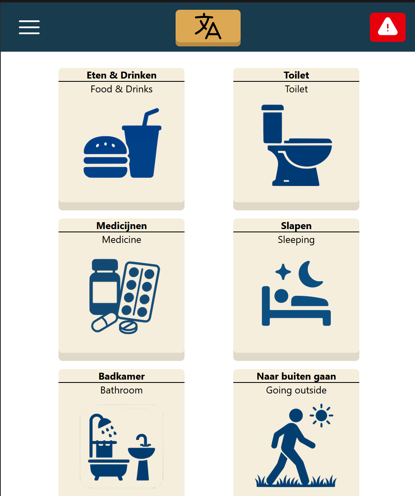
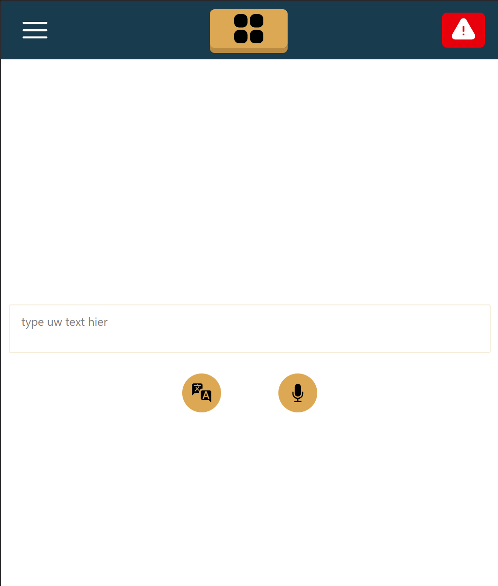
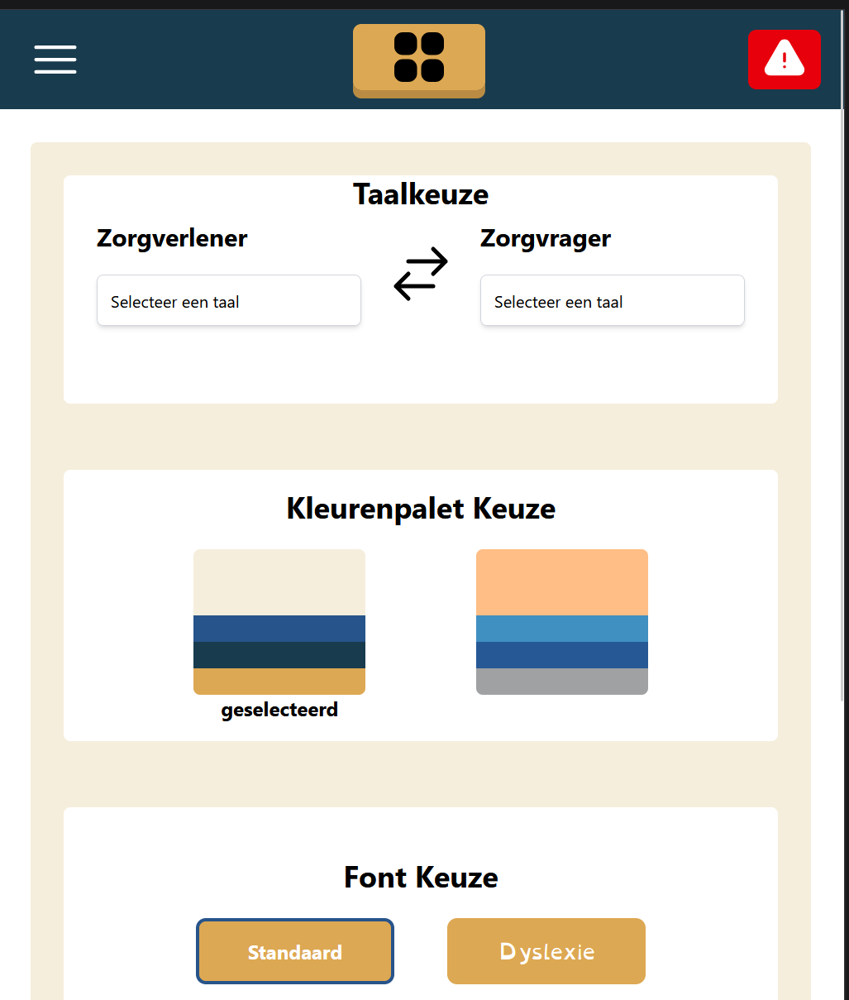
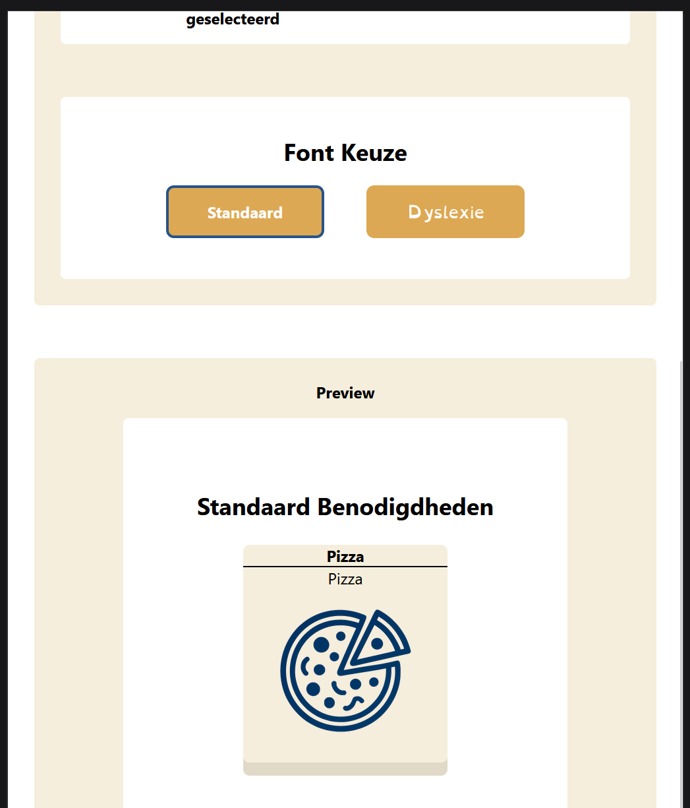
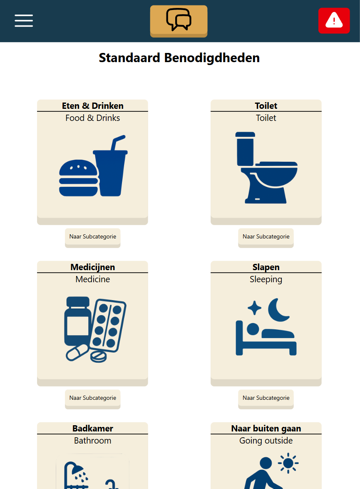
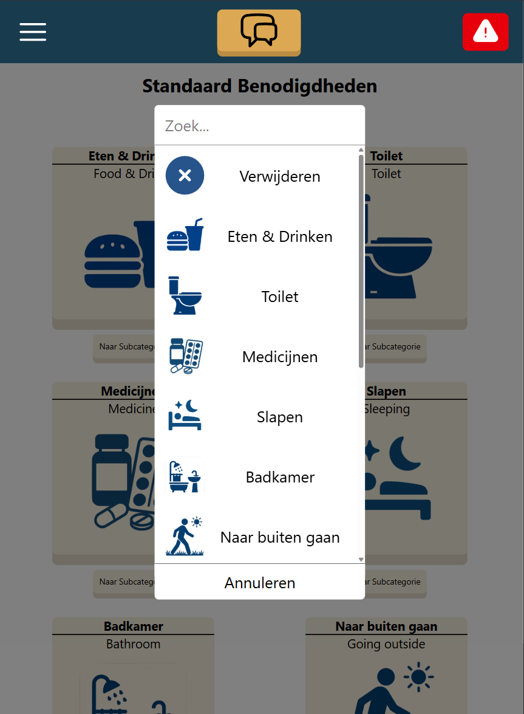
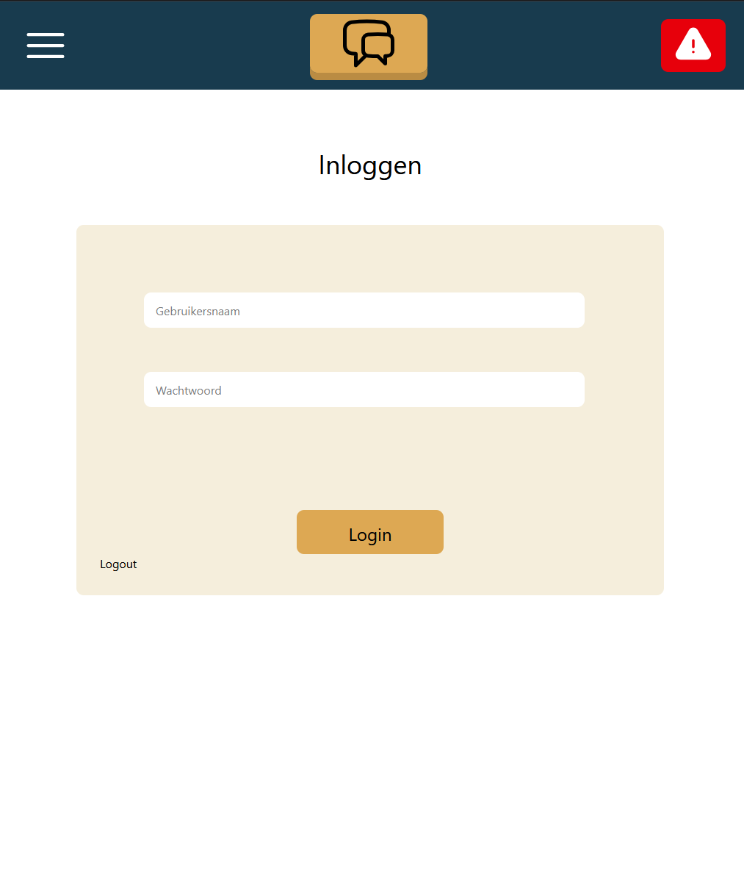
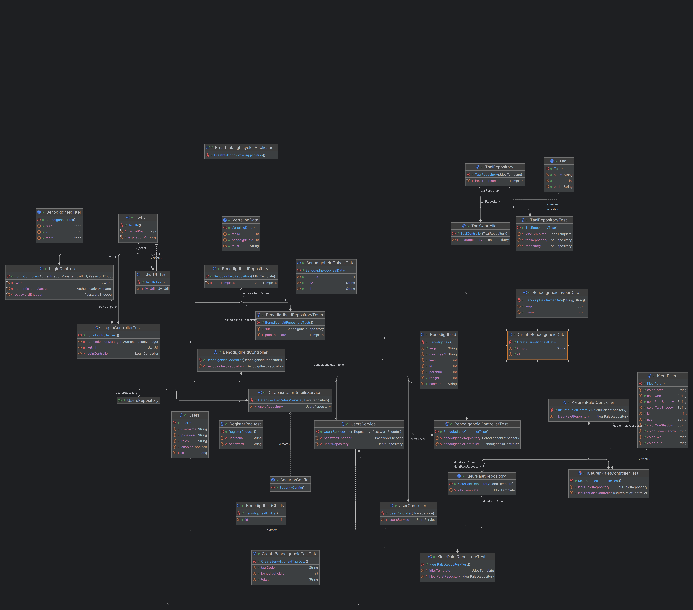
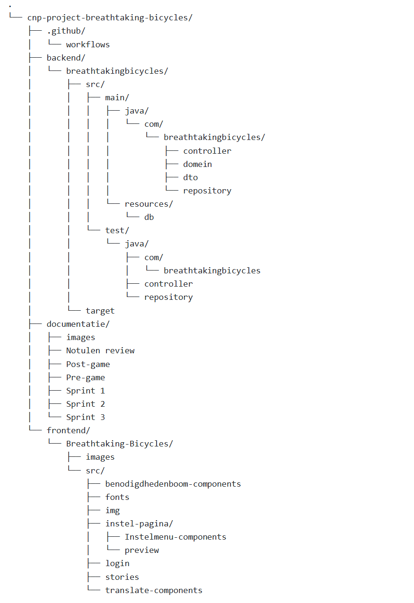
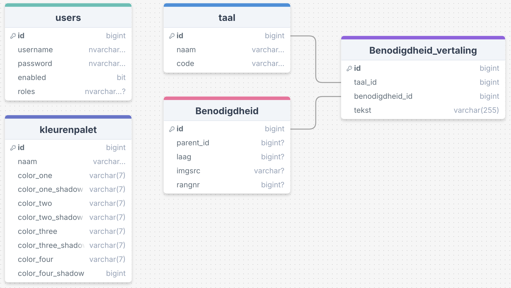

# Software guidebook Breathtaking Bicycles

Dit softwareproject houdt zich bezig met het ontwikkelen van een webapplicatie die communicatie tussen zorgverleners en zorgvragers ondersteunt wanneer er sprake is van een taalbarrière. In zorgsituaties is het van groot belang dat informatie goed wordt begrepen door beide kanten en dit project geeft een digitale oplossing die dit mogelijk maakt.

Binnen het project wordt een prototype gerealiseerd van een webapplicatie waarmee gebruikers gespreksonderwerpen kunnen selecteren, standaardzinnen kunnen laten vertalen, en ook zelf zinnen kunnen invoeren en laten vertalen. De applicatie is instelbaar: gebruikers kunnen de gebruikersinterface aanpassen met verschillende kleurpaletten en lettertypen, en ze kunnen de taal van de interface instellen. Beheerders krijgen daarnaast toegang tot specifieke functionaliteiten waarmee zij standaardbenodigdheden kunnen instellen via een boomstructuurbeheerscherm. Dit stelt hen in staat om de inhoud van de applicatie aan te passen aan de context van de gebruikerssituatie.

Het prototype functioneert los van bestaande softwareomgevingen en is dus niet afhankelijk van bestaande systemen binnen een zorginstelling. Dit biedt flexibiliteit tijdens het ontwikkelen en maakt het mogelijk om zonder integratiebeperkingen een oplossingsgericht ontwerp op te zetten. 

De belangrijkste gebruikers van de applicatie zijn de zorgvrager, de zorgverlener en de beheerder. Voor zorgvrager en zorgverlener biedt het systeem een manier om ondanks taalverschillen met elkaar te communiceren, met name via de vertaalpagina en de pagina voor standaardbenodigdheden. De beheerder heeft op zijn beurt de mogelijkheid om de structuur en inhoud van die pagina’s aan te passen via het beheerscherm, zodat de applicatie actueel en relevant blijft voor de praktijk.

De architectuur van het systeem is ontworpen op basis van de behoeften van deze gebruikersgroepen. De indeling in gebruikersrollen, de functionaliteiten en de interactie tussen gebruikersinterface en beheer zijn allemaal direct terug te voeren op concrete wensen en scenario’s. Het is daarbij belangrijk om inzicht te hebben in de achterliggende use cases of user stories die aan deze keuzes ten grondslag liggen. Als die in een eerder stadium zijn opgesteld, kunnen ze helpen om beter te onderbouwen hoe deze wensen daadwerkelijk zijn vertaald naar ontwerpbeslissingen. Eventueel zou een visuele weergave van de architectuur – zoals een componentendiagram – hierbij extra duidelijkheid kunnen verschaffen.

Door de toepassing van modulaire functies, aanpasbare instellingen en een duidelijke rolverdeling tussen gebruikers wordt het systeem robuust, schaalbaar en gebruiksvriendelijk opgezet. Daarmee vormt het prototype een waardevolle eerste stap richting een oplossing die echt impact kan maken in de zorgpraktijk.

# Functioneel overzicht
De belangrijkste onderdelen van onze applicatie zijn de volgende:
- Standaard benodigdheden
- Vertaling van (ingesproken) berichten
- De aanpasbare UI
- De in te stellen structuur van de standaardbenodigdheden
- Login voor de zorgverlener

---

### Standaard benodigdheden
Als eerste de standaardbenodigdheden, het doel hier van is dat zorgvragers makkelijk kunnen navigeren naar dingen die ze op een reguliere basis gebruiken, zoals eten & drinken en naar de wc gaan. Door op de grote iconen te klikken wordt de naam van de benodigdheid uitgesproken op de speakers, in de taal van de zorgverlener, zodat deze weet wat de zorgvrager graag wilt hebben. 




---

### Vertaalpagina
Verder is het mogelijk om zelf berichten te vertalen, als die bijvoorbeeld niet bij de standaard benodigdheden staan, of iets complexer zijn. Als het bericht is ingevoerd in het tekstveld en is verzonden, detecteerd het systeem automatisch in welke taal het is geschreven. Vervolgens geeft het systeem de tekst terug in de andere taal, dus als het is geschreven in de taal van de zorgvrager wordt het teruggegeven in de taal van de zorgverlener en vice versa. 



--- 

### UI instelmenu
Als derde is er een pagina om de UI in te stellen voor de zorgvrager. Als de zorgvrager een beperking heeft zoals kleurenblindheid of dyslexie, kan de interface hier op worden ingesteld doormiddel van andere kleurenpaletten en een speciaal font voor dyslexie. Onderaan de pagina is een preview waar je kan zien hoe de kleuren en lettertypes die geselecteerd zijn veranderen.  
 



---

### Standaardbenodigdheden instelmenu
Als vierde hebben we een pagina om de structuur van de standaardbenodigdheden in te stellen. Door hier op een pictogram te klikken kun je uit de lijst van benodigdheden kiezen welke je op die plek wilt hebben, daarnaast kun je klikken op naar subcategorie gaan. Hier kun je dan vervolgens benodigdheden onder plaatsen, dus onder "Eten en Drinken", zou je dan "Een glas water" of "Een stuk fruit" kunnen zetten. In dezelfde lijst als het selecteren van de benodigdheden is het ook mogelijk om benodigdheden weg te halen.




--- 

### Inloggen
Als laatste grote functionaliteit hebben we een pagina om in te loggen om bij beide instelmenu's te komen, dit is om te voorkomen dat de zorgvrager perongeluk op een instelmenu klikt, en instellingen aanpast. Het is mogelijk om hier in te loggen als zorgverlener en systeembeheerder. 



---

Verder is het belangrijk dat het hosten van de applicatie voldoet aan een aantal voorwaarden:
- Het moet runnen op een op Chromium gebaseerde browser (Chrome, Edge, etc.) met uitzondering van Brave en Safari. Dit heeft te maken met de functionaliteit van de spraakherkenning. Deze wordt namelijk niet ondersteund op Firefox en een aantal andere browsers. 
- Er moeten 2 docker containers worden gedraaid, 1 voor de database en 1 voor de LibreTranslate API.
- De applicatie moet worden gedraaid op een tablet in de verticale stand. 

---
# Code

## Klassediagram


Boven deze tekst is de klassendiagram van de backend van de applicatie te zien. Hierin zijn de belangrijkste klassen binnen de applicatie verwerkt en zijn de verbindingen die deze klassen met elkaar hebben in kaart gebracht. e backend van deze applicatie is niet heel groot en bevat eenvoudige en makkelijk te begrijpen klassen. 

De klassen die binnen de applicatie het meeste doen zijn de repositoryklassen en de controllerklassen. De repositoryklassen, te vinden in het folder repository, halen de benodigde data uit de database door middel van sql query's. 

In de controllerklassen, te vinden in het folder controller, zijn alle endpoints geïmplementeerd als ingangpunt van de API. 

Voor de login functionaliteit is spring security gebruikt. De belangrijkste klassen hiervoor zijn de SecurityConfig, JwtUtil en de DatabaseUserDetailService. De Config klasse zorgt ervoor dat de login goed is ingesteld en de beveiliging binnen de applicatie dus gewaarborgd wordt. De klasse zorgt er dus voor dat niet alle pagina's binnen de applicatie direct bereikbaar zijn, maar dus beveiligd is met een login.
De DatabaseUserDetailService is een klasse die de gebruikers uit de database ophaald en hiervan een spring security user object maakt. 

### Tests
Voor alle klassen die eerder dit hoofdstuk zijn beschreven zijn uittests geschreven voor zowel de happy als unhappy paths. Al deze unittests slagen en zijn te vinden in het test folder. 

## Folderstructuur
De applicatie is onderverdeeld in een aantal verschillende folders. De backend en frontend zijn beide gescheiden van elkaar. Hieronder is een schematische weergave te zien van onze folderstructuur met daarin de folders die het meest relevant zijn voor dit project.



De belangrijkste folders binnen de applicatie zijn de .github, backend en frontend folders. Binnen deze folders bevindt zich de code die door het project heen geschreven is met de daarbij horende testimplementaties. De tests voor de backend zijn te vinden in het folder "test" en de tests voor de frontend zijn te vinden in het folder "stories".

 In het .github folder staan de workflows die betrekking hebben tot de pipeline die gebruikt werd tijdens dit project. De pipeline wordt verder besproken in het hoofdstuk Integratie.


## Gebruikte Libraries en tools
De backend van de applicatie, opgebouwd met behulp van Maven, is geschreven in Java met behulp van het Springboot framework. Springboot is een open source Java-framework waarmee applicaties gebouwd en gerunt kunnen worden zonder hulp van een externe webserver. Voor de de login is de customizable authentication and access-control Spring Security framework toegepast. De authenticatie en authorisatie zijn door middel van dit framework verwerkt in de applicatie, zodat niet alle pagina's unauthorized bereikbaar zijn voor de gebruiker. 
De frontend bestaat uit componenten die met behulp van React, een javascript library, opgebouwd zijn.

Voor het testen van de backend worden de Maven dependencies Mockito en JUnit Jupiter toegepast, zodat calls naar de database gemocked kunnen worden. Voor de frontend wordt de testtool Storybook toegepast. Storybook staat los van de applicatie. Hierdoor kunnen componenten makkelijk getest worden zonder de applicatie zelf te hoeven starten.

# Data

## Database


Hierboven is het diagram van onze database. We hebben een redelijk kleine database, met maar 5 tabellen. Alle tabellen zijn voorzien van een id-kolom. Bij benodigdheid zijn er een aantal kolommen die null kunnen zijn, dit heeft te maken met het feit dat niet alle benodigdheden tegelijkertijd worden gebruikt. Dus als ze geen rangnr, laagnr en parent_id hebben staan ze op non-actief. Verder heeft users een kolom "enabled", deze houdt in dat een account op dat moment actief is of niet.

Er wordt gebruikt gemaakt van een Microsoft-SQL database voor Microsoft platforms en een Azure-SQL database voor Apple gebaseerde platforms deze worden gedraaid door middel van een Docker container. Voor het opzetten van de database staat in docker-compose.yml, die te vinden is in "cnp-project-breathtaking-bicycles/backend/breathtakingbicycles/src/main/resources/db", welke image er gebruikt moet worden voor zowel een Microsoft platform en een Apple platform. 

In "application.properties" (te vinden in "cnp-project-breathtaking-bicycles/backend/breathtakingbicycles/src/main/resources") staat de connectie naar de database. Hier zijn ook de gebruikersnaam en het wachtwoord te vinden om toegang te kunnen verkrijgen naar de database. Voor de verbinding van de backend naar de database gebruiken we een JDBC-connectie. 

De seedfiles voor de database zijn te vinden in "cnp-project-breathtaking-bicycles/backend/breathtakingbicycles/src/main/resources/db".

## Andere data

Wij gebruiker naast de database ook nog de LibreTranslate API, hier wordt de ingevoerde tekst naartoe verstuurd, deze wordt vervolgens vertaald naar de gewenste taal, om vervolgens de vertaalde tekst terug te geven.

Ook gebruiken we de SpeechRecognition Browser API, deze neemt ingesproken tekst op, en geeft getranscribeerde tekst terug. 

# CI-pipeline en Productie Deployment

## 1. CI-pipeline (GitHub Actions)

Onze CI-pipeline draait automatisch bij elke **pull request** via GitHub Actions. De pipeline is verdeeld over drie jobs:

### frontend
- Installeert Node.js v18
- Schoont de cache en dependencies
- Installeert npm dependencies
- Buildt Storybook statisch (`npm run build-storybook`)

### backend
- Gebruikt Java 21 via Temurin distributie
- Voert alle JUnit-tests uit via Maven (`mvn test`)

### lint
- Installeert Node.js v20
- Voert ESLint uit op frontend-code (`npx eslint "**/*.{js,jsx}"`)
- Sluit `storybook-static` uit van linting

De configuratie is te vinden in `.github/workflows/unit-tests.yml`.

## 2. Deployment naar een nieuwe productie-server

### Benodigdheden

- Linux-server (getest op Ubuntu 22.04+)
- Internettoegang
- Poorten 80 en 443 open
- SSH-toegang voor beheer

## 3. Productie Deployment Instructies

### Installatie
- Clone de repository op de server
- installeer dependecies met npm
- run backend metn maven

  ```bash
  git clone https://github.com/AIM-CNP-sep24/cnp-project-breathtaking-bicycles.git
  
  cd cnp-project-breathtaking-bicycles/frontend/Breathtaking-Bicycles
  npm install

  cd cnp-project-breathtaking-bicycles/backend/breathtakingbicycles
  mvn spring-boot:run```


